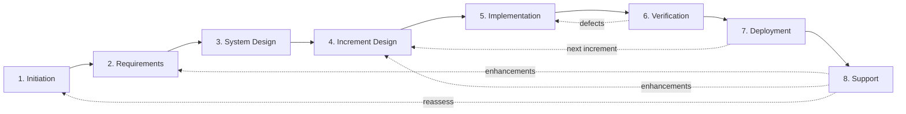

# Agentic Workflow Guide

## Overview

Structured entry point for AI agents working with the AI-Assisted SDLC framework
— providing machine-readable stage routing, artifact dependencies, and fallback
protocols in a single file.

### Why This Guide

The framework's stage guides, checklists, and references are optimized for human
readers navigating one stage at a time. An AI agent dropped into this repository
needs a different interface: a single file with structured metadata for
programmatic routing and enough narrative context to operate autonomously across
stages. This guide is that interface.

### Purpose

- Provide a single entry point for agents to orient in this repository
- Expose stage routing, inputs/outputs, and gates as structured YAML
- Define fallback protocols for common agent failure modes
- Establish session continuity conventions for multi-session work

### Key Principle

Front matter is the agent's primary interface; the body provides human-readable
context for the same information. Parse the YAML first, read the prose when you
need rationale or nuance.

> **Schema authority:** The front matter in this file is **prescriptive** — it
> is the authoritative source for stage routing, artifact dependencies, and gate
> requirements when consumed by agents. If a conflict exists between this schema
> and the prose in `stages/*/README.md`, this schema takes precedence for agent
> routing decisions.

> **Role assignments:** This guide defines *what* to do at each stage. For *who*
> does it, see [Roles and Responsibilities](framework.md#roles-and-responsibilities)
> in the Framework Guide. The RACI matrix defines which role is Responsible,
> Accountable, Consulted, or Informed at each stage.

### How to Use This Guide

1. **Parse the front matter** — stage routing, artifact dependencies, gates, and
   fallback rules are all in the YAML block above
2. **Identify your current stage** from the [**Stage Routing**](#stage-routing)
   table
3. **Check inputs and outputs** — verify required inputs are available before
   starting a stage
4. **Follow gate requirements** — each stage specifies what human oversight is
   needed
5. **Use fallback protocols** when stuck — see
   [**Error and Fallback Guidance**](#error-and-fallback-guidance)
6. **Maintain session logs** — see
   [**Session Continuity Protocol**](#session-continuity-protocol) for
   multi-session work

> **Human readers using chat-based AI tools?** See the
> [Manual Process Guide](manual-process.md) instead — it provides bootstrap
> prompts and step-by-step instructions for working with AI assistants that
> don't have filesystem access.

---

## Stage Routing

This table mirrors the `stages` array in the front matter. Use the front matter
for programmatic access; use this table for quick human reference.

| #   | Stage            | Pattern      | Default Autonomy | Location    | Gate Type                         | Feeds Into                 |
| --- | ---------------- | ------------ | ---------------- | ----------- | --------------------------------- | -------------------------- |
| 1   | Initiation       | Foundational | Collaborative    | Artifacts   | Human approval                    | Requirements               |
| 2   | Requirements     | Foundational | Collaborative    | Artifacts   | Quality checkpoint (human approval) | System Design              |
| 3   | System Design    | Foundational | Collaborative    | Artifacts   | Alignment review + human approval | Increment Design           |
| 4   | Increment Design | Iterative    | Collaborative    | Artifacts   | Specialized review                | Implementation             |
| 5   | Implementation   | Iterative    | AI-Led           | Source Code | CI validation + human approval    | Verification               |
| 6   | Verification     | Iterative    | AI-Led           | Source Code | CI validation + human spot-check  | Deployment, Implementation |
| 7   | Deployment       | Iterative    | Human-Led        | Artifacts   | Human execution required          | Support, Increment Design  |
| 8   | Support          | Continuous   | Collaborative    | Artifacts   | Human approval                    | Multiple stages            |

The **Location** column indicates where the agent should operate during each
stage — either the artifacts repository (`docs/`) or the source code repository.
See [Working Locations](framework.md#working-locations) for the full
three-location model.

**Execution patterns:**

- **Foundational** (stages 1–3) — run once per project, revisitable when
  assumptions change
- **Iterative** (stages 4–7) — repeat per increment of deliverable work
- **Continuous** (stage 8) — ongoing after first production deployment

For full stage definitions, see [AI-Assisted SDLC Stages](stages.md).

### Brownfield-First Project Routing

For brownfield projects introducing AI assistance for the first time, route
through stages with additional focus:

1. **Initiation** — assess brownfield readiness across six axes (safety net,
   modularity, deployability, operability, discoverability, transparency). See
   [Brownfield Readiness Guide](brownfield-readiness.md#readiness-rubric)
2. **System Design** — refine the readiness assessment with evidence, plan
   discovery or preparation increments, and define feature flag strategy for
   modifying existing endpoints
3. **Increment Design** — map scope to readiness dimensions; discovery
   increments use deliverable-oriented scope (D-1, D-2 IDs) rather than
   feature-oriented scope
4. **Subsequent stages** — proceed normally using iterative stage patterns

---

## Artifact Dependencies

This table maps each stage's key outputs to their templates, upstream
dependencies, and downstream consumers. Derived from stage front matter
(`inputs`, `outputs`, `feeds_into`) cross-referenced with
[AI-Assisted SDLC Stages](stages.md). For the machine-readable source of truth,
parse the `stages` array in this file's front matter.

**Embedded artifact resolution rule:** When a stage input names an artifact
declared `embedded_in` a parent artifact, the parent artifact satisfies the
input requirement. For example, System Design's input `non-functional-requirements`
is satisfied by the Requirements Brief (which contains the NFR section).

All template paths are relative to `templates/`.

| Stage            | Artifact                  | Template                       | Depends On                                     | Feeds Into                          | Gate                             |
| ---------------- | ------------------------- | ------------------------------ | ---------------------------------------------- | ----------------------------------- | -------------------------------- |
| Initiation       | Initiation Brief          | `initiation-brief.md`          | _External inputs_                              | Requirements                        | Gate 1 (Investment Decision)     |
| Initiation       | Success Criteria Register | `success-criteria-register.md` | _External inputs_                              | All stages (referenced)             | Gate 1                           |
| Initiation       | Assumptions & Risks List  | —                              | _External inputs_                              | Requirements                        | Gate 1                           |
| Initiation       | Timeline Estimate         | —                              | _External inputs_                              | Requirements                        | Gate 1                           |
| Requirements     | Requirements Brief        | `requirements-brief.md`        | Initiation Brief, Success Criteria Register    | System Design                       | Requirements Readiness           |
| Requirements     | User Stories + ACs        | — _(embedded in brief)_        | Initiation Brief, Success Criteria Register    | Increment Design, Implementation    | Requirements Readiness           |
| Requirements     | Feature Backlog           | — _(embedded in brief)_        | Initiation Brief, Success Criteria Register    | Increment Design                    | Requirements Readiness           |
| Requirements     | Traceability Matrix       | —                              | Requirements Brief                             | System Design                       | Requirements Readiness           |
| System Design    | System Design Brief       | `system-design-brief.md`       | Requirements Brief, NFRs                       | Increment Design, Implementation    | Architecture Review + Gate 2     |
| System Design    | Technology ADRs           | `adr.md`                       | Requirements Brief                             | Implementation                      | Architecture Review + Gate 2     |
| System Design    | Increment Plan            | —                              | Requirements Brief                             | Increment Design                    | Architecture Review + Gate 2     |
| System Design    | Infrastructure Plan       | —                              | NFRs                                           | Deployment                          | Architecture Review + Gate 2     |
| System Design    | Gate 2 Decision Package   | `gate-decision.md`             | All System Design outputs                      | —                                   | Gate 2 (Investment Decision)     |
| Increment Design | Component Designs         | `increment-design-brief.md`    | Architecture, Increment Plan, Stories + ACs    | Implementation                      | Design Review                    |
| Increment Design | API Specifications        | —                              | Architecture                                   | Implementation                      | Design Review                    |
| Increment Design | Test Strategy             | —                              | Stories + ACs                                  | Implementation, Verification        | Design Review                    |
| Implementation   | Working Code              | —                              | Component Designs, Architecture, Stories + ACs | Verification                        | PR Review + CI                   |
| Implementation   | Unit Tests                | —                              | Working Code, Test Strategy                    | Verification                        | PR Review + CI                   |
| Implementation   | Implementation Brief      | `implementation-brief.md`      | Working Code, Session Logs                     | Verification, Deployment            | PR Review + CI                   |
| Verification     | Test Results              | `verification-brief.md`        | Working Code, Stories + ACs, Test Strategy, Implementation Brief | Deployment               | Test Execution + Coverage Review |
| Verification     | UAT Sign-Off              | —                              | Test Results                                   | Deployment                          | Test Execution + Coverage Review |
| Verification     | Defect Reports            | —                              | Test Results                                   | Implementation _(rework)_           | Test Execution + Coverage Review |
| Deployment       | Deployed System           | `deployment-brief.md`          | Verified Code, UAT Sign-Off, Rollback Plan, Implementation Brief | Support                    | Production Deployment Approval   |
| Deployment       | Release Notes             | —                              | Deployed System                                | Support                             | Production Deployment Approval   |
| Deployment       | Updated Runbooks          | `runbook.md`                   | Deployed System                                | Support                             | Production Deployment Approval   |
| Deployment       | Baseline Measurements     | —                              | Deployed System, Success Criteria              | Support                             | Production Deployment Approval   |
| Deployment       | Retrospective             | `retrospective.md`             | Deployed System, Session Logs                  | Increment Design _(next increment)_ | —                                |
| Support          | Availability Metrics      | `support-brief.md`             | Deployed System, Monitoring                    | —                                   | Production Ownership Decision    |
| Support          | Success Criteria Reports  | —                              | Baseline Measurements                          | Initiation _(reassess)_             | Production Ownership Decision    |
| Support          | Enhancement Backlog       | —                              | Incident Reports                               | Requirements, Increment Design      | Production Ownership Decision    |

### Gate Decision Template Selection

- **Hard gates** (Gate 1, Gate 2): use `templates/gate-decision.md`
- **Non-investment checkpoints** (all others, including Production Deployment Approval): use
  `templates/checkpoint-decision.md`
- **PR Review + CI**: the PR approval itself serves as the gate artifact; no
  separate decision template is required

### Stage Flow Diagram

**Solid arrows** show the primary forward flow. **Dashed arrows** show feedback
loops — defects return to Implementation for rework, Deployment feeds into
Increment Design for the next increment, enhancements feed back to Requirements
or Increment Design, and Support findings may trigger reassessment of Initiation
assumptions.

---

## Quick Start by Autonomy Tier

### Human-Led

The agent assists on request. Humans drive every step.

1. Read the stage README for guidance and rationale
2. Wait for human instructions before producing artifacts
3. Generate drafts, options, and analyses when asked
4. Present outputs for human review before proceeding

### Collaborative

The agent co-authors within human-set boundaries. This is the default tier.

1. Read the stage README and checklist
2. Propose a work plan for the current stage
3. Draft artifacts proactively, flagging assumptions
4. Pause at gates for human review and approval
5. Iterate based on human feedback

### AI-Led

The agent drives the process. Humans validate at gates.

1. Read the stage README, checklist, and reference (if available)
2. Assess inputs — flag any that are missing or ambiguous
3. Execute stage activities autonomously, following the stage guide
4. Self-validate intermediate work against checklist criteria
5. Present completed artifacts at gates for human validation
6. Between increments: review the previous increment's retrospective (if any)
   and check pre-mortem assumptions before starting the next Increment Design
7. Use fallback protocols (below) when blocked

For oversight intensity within AI-Led (Active / Passive / Minimal), see the
[AI Assistance Scorecard: Oversight Intensity](ai-assistance.md#oversight-intensity).

---

## Agent Execution Model

Recommended workflow for AI coding agents operating in this repository:

1. **Orient** — read `guides/agentic-workflow.md` (parse front matter first for
   stage routing, then body for context). Determine your working location from
   the `working_location` field for the current stage.
2. **Locate stage** — identify the current stage from the routing table; read
   the stage README, checklist, and reference. If the current stage is not clear
   from the human's request, check for existing session logs or artifacts to
   infer project state; if no artifacts exist, start at Initiation.
3. **Check front matter** — verify required inputs are available; flag any
   missing inputs with `[ASSUMED]`
4. **Execute** — follow the stage guide activities at the appropriate autonomy
   tier; self-validate against the checklist
5. **Gate** — present completed artifacts for human review at defined gates;
   follow fallback protocols from `stages/[stage]/reference.md` if blocked
6. **Log** — for multi-session work, maintain a session log using
   `templates/session-log.md`; read on start, write on end

---

## Error and Fallback Guidance

These protocols match the `fallback` section in the front matter. Use them when
the agent encounters obstacles during autonomous operation.

> **Human-Led tier:** At Human-Led tier, request human direction before deriving
> inputs or attempting gate remediation. The protocols below assume collaborative
> or AI-led autonomy. Human-Led agents should halt and present the situation to
> the human rather than acting autonomously.

### Missing Input

An expected input artifact is unavailable or incomplete.

1. Check whether the input can be derived from available context
2. If derivable, produce the input and flag it with `[ASSUMED]` — clearly state
   what was assumed and why
3. If not derivable, request the input from the human
4. Do not proceed past a gate with assumed inputs unless the human explicitly
   approves

### Reviewing [ASSUMED] Items

When an artifact reaches gate review, every `[ASSUMED]` item requires an
explicit disposition:

- **Confirm** — the assumption has been verified as correct. Remove the
  `[ASSUMED]` tag and update the artifact.
- **Challenge** — the assumption is incorrect or needs revision. Correct the
  content, remove the `[ASSUMED]` tag, and note the correction.
- **Carry forward** — the assumption cannot be verified at this gate (e.g.,
  depends on future discovery). Leave the tag, document the item as a condition
  in the [Gate Decision Template](../templates/gate-decision.md), and assign an
  owner to resolve it before the next gate.

Do not proceed past a gate with unaddressed `[ASSUMED]` items — each one must
have a recorded disposition.

### Failed Gate

A gate check fails — checklist criteria not met, tests failing, or review
rejected.

1. Document the specific failure reason
2. Attempt remediation (fix the issue, update the artifact)
3. Re-run the gate check
4. If remediation fails after one retry, escalate to the human with a summary of
   what was tried

At hard gates (Gate 1, Gate 2), skip autonomous remediation — escalate to the
human immediately with the failure reason and do not re-run the gate check
without human direction.

### Ambiguous Requirements

Requirements can be interpreted multiple ways.

1. List all reasonable interpretations
2. Assess risk and effort for each interpretation
3. Recommend the interpretation with the lowest risk
4. Request the human to confirm before proceeding
5. Document the decision and rationale

### Unreachable Human

The agent needs human input but cannot get it (async workflow, human
unavailable).

1. Continue with the lowest-risk option
2. Flag every decision made without human input
3. Compile a decision log for the human to review when available
4. Do not proceed past hard gates (Gate 1, Gate 2) without human approval
5. At Human-Led tier, halt and log all context for human review rather than
   continuing autonomously
6. At Collaborative tier, "continue" means continue work within the current
   stage only — do not advance to the next stage or pass a gate without human
   approval

### Precedence and Compound Conditions

When multiple fallback conditions apply simultaneously, resolve in this order:

1. **Hard gate constraints take priority** — if a hard gate blocks and the human
   is unreachable, log all context and halt. Do not proceed past hard gates
   without human approval under any circumstances. Attempt to derive missing
   inputs with `[ASSUMED]` flag before halting, so context is maximally prepared
   for human review upon return.
2. **Unreachable Human** — determine whether to wait or continue based on gate
   type and autonomy tier.
3. **Missing Input** — attempt to derive or request; if the human is
   unreachable, follow step 1/2 above.
4. **Ambiguous Requirements** — lowest priority; resolve after inputs and human
   availability are determined.

Stage-specific fallback guidance in `stages/[stage]/reference.md` extends these
central protocols. Where a stage-specific protocol contradicts this section, the
stage-specific protocol takes precedence for that stage. Stage-specific fallback
protocols apply at all autonomy tiers unless the stage reference explicitly
restricts them to a specific tier.

---

## Session Continuity Protocol

Multi-session work requires explicit context handoff. Use the session log
template to maintain continuity across sessions, agents, or participants.

### Read on Start

At the beginning of every session:

1. Read the session log for the current stage (if one exists)
2. Review the "Context for Next Session" and "Next Steps" from the last entry
3. Check artifact progress to understand current state
4. Confirm your understanding with the human before proceeding

### Write on End

At the end of every session:

1. Update the session log with a new entry
2. Record what was completed, what is in progress, and what decisions were made
3. Note any deviations from the design brief — where implementation diverged
   from plan and why
4. Document any blockers
5. Write "Context for Next Session" — the critical information the next
   agent/human needs to continue without re-reading everything
6. List specific "Next Steps" as actionable items
7. Capture any in-the-moment observations (surprises, deviations, framework
   gaps) by appending a row to the retrospective's Captured Feedback table — see
   [Feedback Capture Protocol](#feedback-capture-protocol) below; do not
   classify at capture time

### Session Log Template

Each stage's work gets its own session log file, stored alongside the stage's
artifacts. Create a new log file per stage (e.g.,
`docs/session-logs/initiation-session-log.md`) and update it at the start and
end of every session.

Use [Session Log](../templates/session-log.md) (`templates/session-log.md`) for
all stages. The generalized template captures stage name, autonomy tier,
oversight level, artifact progress, and per-session entries including decisions
made and context for the next session.

For the Implementation stage specifically, use the
[Implementation Session Log](../templates/implementation-session-log.md)
(`templates/implementation-session-log.md`) — a specialized variant optimized
for code-focused session tracking.

### Revision History Roles

When recording revision history in artifacts (Author, Approved By columns), use
these role definitions to clarify each contributor's relationship to the
content:

- **Author** — shaped the content. The person or agent who drove the substance
  of the artifact, not merely the one who typed or generated text.
- **Reviewer** — reviewed the artifact and provided substantive feedback that
  influenced the final content.
- **Approver** — approved the artifact without substantive changes. Confirms the
  artifact meets gate criteria.

**Format:** `Name (Role)` — e.g., `Jane Smith (Author)`,
`Claude Sonnet (Reviewer)`.

**Agent-specific guidance:** Role reflects who drove the work, not who typed. An
agent that generates an artifact from a detailed human brief is typically listed
as Author only if it made substantive decisions beyond mechanical translation.
Consider the autonomy tier:

| Autonomy Tier | Typical Author            | Rationale                              |
| ------------- | ------------------------- | -------------------------------------- |
| Human-Led     | Human                     | Human shaped all content               |
| Collaborative | Human and/or agent        | Depends on who drove each section      |
| AI-Led        | Agent (human as Approver) | Agent drove substance; human validated |

When multiple contributors share authorship, list each with their role. When in
doubt, credit the contributor who made the substantive decisions rather than the
one who generated text.

### Feedback Capture Protocol

When an observation arises during any stage — a surprise, a deviation from
design, a process friction point, a framework gap, or a value idea (feature
possibility, technical improvement, architectural opportunity) — capture it
immediately rather than waiting for the retrospective session.

**Steps:**

1. Locate the current increment's retrospective artifact in the project's
   artifact location (e.g., `retrospectives/retro-increment-N.md`).
2. If the file does not exist, create it from the
   [Retrospective Template](../templates/retrospective.md). Set the Scope and
   Date fields; leave analysis sections as placeholders.
3. Append a row to the **Captured Feedback** table:
   - **Timestamp:** today's date (YYYY-MM-DD)
   - **Stage:** current stage name
   - **Observation:** concise description of the surprise, friction, or value
     idea
4. Do not classify the observation. Classification happens during the
   retrospective session — framework observations move to Framework Feedback,
   process items to What Went Well / What Didn't Work, actionable items to
   Action Items, and value ideas surface during the Future Value Candidates
   harvest at project wrap-up.

> Agents: this is a write action. Follow artifact location conventions in
> [Working Locations](../guides/framework.md#working-locations) and verify the
> correct artifacts path before writing.

### Cross-Location Handoff Protocol

When work crosses location boundaries — especially from source code
(Implementation) back to artifacts (briefs, session logs) or forward to
Verification — decisions, deferrals, and deviations must flow back explicitly.

#### What Flows Back

| Item Type              | Example                                | Target Artifact                                     |
| ---------------------- | -------------------------------------- | --------------------------------------------------- |
| Decisions              | Chose library X over Y for concurrency | Implementation brief + session log                  |
| Deferrals              | Deferred pagination to next increment  | Implementation brief "Known Issues" + carry-forward |
| Deviations from design | API endpoint changed from POST to PUT  | Session log + implementation brief                  |
| Emergent requirements  | Discovered need for rate limiting      | Retrospective Captured Feedback                     |

#### Sync Points

1. **End of session** — update session log with decisions and deviations
2. **End of increment** — finalize implementation brief, sync deferrals to
   carry-forward list
3. **Verification handoff** — ensure all implementation decisions are documented
   for testers
4. **Next increment design start** — review carry-forward items and
   retrospective feedback before scoping

#### Agent Protocol

At each sync point, agents should:

1. Review the session log for undocumented decisions or deviations
2. Update the implementation brief with any decisions not yet recorded
3. Record deferrals in the implementation brief "Known Issues" section and flag
   them for carry-forward
4. Capture emergent requirements in the retrospective's Captured Feedback table
   (see [Feedback Capture Protocol](#feedback-capture-protocol))
5. Verify that the artifacts location reflects the current state of work in the
   source code location

> See [Working Locations](framework.md#working-locations) for the three-location
> model and [Session Continuity Protocol](#session-continuity-protocol) for
> session log conventions.

---

## Rework Cycles

When a mid-stage discovery breaks something — a design proves infeasible, an NFR
is unmet, or an assumption is invalidated — classify the rework by severity and
follow the corresponding process. See
[Framework Guide: Mid-Stage Discovery](framework.md#mid-stage-discovery) for the
full decision tree and classification table.

- **Cosmetic** — fix in place, update the artifact. No additional process.
- **Significant** — produce a delta-only brief documenting what changed, update
  affected artifacts, and record an ADR for the decision.
- **Fundamental** — produce a delta-only brief, record an ADR, and amend the
  original gate decision with new information and a new decision.

### Delta-Only Brief Convention

- **New briefs document only what changed** — reference the prior cycle's brief
  for unchanged context rather than duplicating it
- **Reference the prior cycle explicitly** — e.g., "This rework addresses
  verification failures from Increment 2, Cycle 1 (see verification-brief-i2.md
  for defect details)"
- **Design briefs are typically not revised** — unless the verification failure
  reveals a design-level issue, rework stays within Implementation scope
- **Update the Measurement Throughline only if instrumentation changes** — if
  rework doesn't affect how success criteria are measured, carry forward the
  existing measurement plan without revision

---

## Notes

**Last Updated:** 2026-03-19

Added to framework in v0.23.0. Artifact dependency graph added in v0.23.0.
