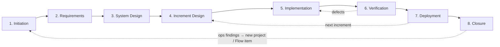

# Agentic Workflow Guide

## Overview

Structured entry point for AI agents working with the AI-Assisted SDLC framework
— providing machine-readable stage routing, artifact dependencies, and fallback
protocols in a single file.

### Why This Guide

The framework's stage guides, checklists, and references are optimized for human
readers navigating one stage at a time. An AI agent dropped into this repository
needs a different interface: a single file with structured metadata for
programmatic routing and enough narrative context to operate autonomously across
stages. This guide is that interface.

### Goals of This Guide

- Provide a single entry point for agents to orient in this repository
- Expose stage routing, inputs/outputs, and gates as structured YAML
- Define fallback protocols for common agent failure modes
- Establish session continuity conventions for multi-session work

### Key Principle

Stage READMEs (`stages/*/README.md`) are the **canonical source** for stage
metadata — inputs, outputs, checkpoints, and RACI roles. Autonomy is an
operating-model choice, not a stage property (see the
[Operating Model Guide](operating-model.md)); the pipeline's revisit conditions
live in the [Stages Guide](stages.md). This guide provides cross-cutting
concerns: artifact paths, working locations, fallback protocols, and session
conventions.

> **Role assignments:** This guide defines _what_ to do at each stage. For _who_
> does it, see [Roles and Responsibilities](roles.md#roles-and-responsibilities)
> in the Roles Guide. The RACI matrix defines which role is Responsible,
> Accountable, Consulted, or Informed at each stage.

### How to Use This Guide

1. **Read stage README front matter** — each `stages/*/README.md` contains the
   canonical stage metadata (inputs, outputs, checkpoints, RACI)
2. **Identify your current stage** from the [**Stage Routing**](#stage-routing)
   section
3. **Check inputs and outputs** — verify required inputs are available before
   starting a stage
4. **Follow gate requirements** — each stage specifies its required gates and
   checkpoints
5. **Use fallback protocols** when stuck — see
   [**Error and Fallback Guidance**](#error-and-fallback-guidance)
6. **Maintain session logs** — see
   [**Session Continuity Protocol**](#session-continuity-protocol) for
   multi-session work

> **New to the framework?** See the [Bootstrap Guide](bootstrap.md) for setup
> instructions, working location configuration, and a ready-to-use prompt
> template for your first project.

---

## Stage Routing

For stage ordering, execution patterns, and the dependency graph, see the
[AI-Assisted SDLC Stages](stages.md) pipeline front matter. For per-stage
metadata (inputs, outputs, checkpoints, RACI), parse the stage README front
matter in `stages/*/README.md`. The `working_location` field in each stage
README indicates where the agent should operate — either the artifacts
repository (`docs/`) or the source code repository. See
[Working Locations](framework.md#working-locations) for the full three-location
model.

### Brownfield-First Project Routing

For brownfield projects introducing AI assistance for the first time, route
through stages with additional focus:

1. **Initiation** — assess brownfield readiness across five axes (verifiability,
   modularity, discoverability, transparency, consistency). See
   [Brownfield Readiness Guide](brownfield-readiness.md#readiness-rubric)
2. **System Design** — refine the readiness assessment with evidence, plan
   discovery or preparation increments, and define feature flag strategy for
   modifying existing endpoints
3. **Increment Design** — map scope to readiness axes; discovery increments use
   deliverable-oriented scope (D-1, D-2 IDs) rather than feature-oriented scope
4. **Subsequent stages** — proceed normally using iterative stage patterns

### Zero-to-One Project Routing

A new project reaches the framework through one front door — idea formation, the
adaptive interview defined in
[Initiation: Arriving with Only an Idea](../stages/initiation/README.md#arriving-with-only-an-idea)
— by one of **two on-ramps**:

- **Cold (greenfield).** A user arrives with only an idea — "I have an idea for
  X," no existing artifacts, no workspace, no formed project description. The
  interview starts from a blank page.
- **Warm (from the backlog).** A **Promoted** idea-backlog entry (`IDEA-NNN`)
  already carries a problem statement and an origin (see
  [The Learning Loop](learning-loop.md#closing-the-portfolio-loop)). The
  interview starts there — deepening, validating, and seeding the project's
  operating configuration — rather than from scratch.

Either way, do not ask the user to pick a framework entry point or answer
classification questions. Route into idea formation:

1. **Idea formation** — interview from the idea to Initiation-ready inputs: a
   candidate problem statement, a target user, and the riskiest assumptions
   surfaced. Scale the interview's depth to the inferred stakes and infer the
   classifications rather than fronting them — the exit criteria, interview
   contract, and adaptive frame are defined in
   [Initiation: Arriving with Only an Idea](../stages/initiation/README.md#arriving-with-only-an-idea).
   On the warm on-ramp, the backlog entry's problem statement is the interview's
   starting point, not a blank page
2. **Classify by inference** — derive tier, project type, deployment intent,
   operating posture, and Required Assurance from the conversation and present
   them as overridable `[ASSUMED]` defaults, rather than asking the user to
   choose from framework taxonomies. See
   [Classification by Inference](#classification-by-inference)
3. **Scaffold and seed** — only after the interview, create the workspace (see
   [Quick Start](../QUICKSTART.md)) and seed the Initiation Brief with the
   interview output
4. **Proceed with Initiation** — continue the stage normally at the inferred
   tier; Gate 1 still applies, and locks the operating posture the interview
   proposed

---

## Classification by Inference

A new project carries five classification decisions: **tier** (Minimal /
Standard / Enterprise), **project type** (greenfield / brownfield), **deployment
intent** (production service / internal tool / local-only), **operating
posture** (Supervised / Checkpointed / Lights-Out), and **Required Assurance**
(see [Operating Model Guide](operating-model.md)). A first-time user cannot
answer these before understanding the framework — do not present them as menus
at first contact.

Instead, derive all five from two or three natural questions woven into the
opening conversation:

- _"Is this just you, or a team?"_ → stakeholder reach, candidate tier
- _"Is this an experiment, or something you'll run for real?"_ → tier,
  deployment intent
- _"Deploying anywhere yet, or local for now?"_ → deployment intent
- _"Starting fresh, or building on existing code?"_ → project type

Present the derived classifications as overridable assumptions using the
`[ASSUMED]` convention, recorded in the Initiation Brief's right-sizing section:

> `[ASSUMED]` Tier: Minimal — solo experiment, no sensitive data. `[ASSUMED]`
> Project type: Greenfield — empty repository. `[ASSUMED]` Deployment intent:
> Local-only for now. `[ASSUMED]` Operating posture: Checkpointed — framework
> default for a first project. Say the word and any of these change.

Rules:

1. **Never front a framework taxonomy.** The user should reach the problem
   conversation without being asked to pick from any framework menu. Introduce
   vocabulary later, when a classification first matters (typically at Gate 1).
2. **Default conservatively.** When signals are missing or conflict, prefer the
   safer value — higher tier, more oversight — and flag it.
3. **Escalation triggers override inference.** Sensitive data, compliance
   requirements, or external users force Standard or Enterprise regardless of
   conversational signals — see the [Right-Sizing Guide](right-sizing.md).
4. **Inferred values are hypotheses.** Confirm them at Gate 1 like any other
   `[ASSUMED]` item — see
   [Reviewing \[ASSUMED\] Items](#reviewing-assumed-items).

---

## Artifact Dependencies

Each stage's `inputs` and `outputs` are defined in its README front matter
(`stages/*/README.md`). The `feeds_into` field in the [Stages Guide](stages.md)
pipeline front matter defines the dependency graph.

**Embedded artifact resolution rule:** When a stage input names an artifact
declared `embedded_in` a parent artifact, the parent artifact satisfies the
input requirement. For example, System Design's input
`non-functional-requirements` is satisfied by the Requirements Brief (which
contains the NFR section).

### Gate Decision Template Selection

- **Hard gates** (Gate 1, Gate 2): use `templates/gate-decision.md`
- **Non-investment checkpoints** (all others, including Production Deployment
  Approval): use `templates/checkpoint-decision.md`
- **PR Review + CI**: the PR approval itself serves as the gate artifact; no
  separate decision template is required

### Stage Flow Diagram

**Solid arrows** show the primary forward flow. **Dashed arrows** show feedback
loops — defects return to Implementation for rework, Deployment feeds into
Increment Design for the next increment, and Closure closes the project with a
handoff to Operations. Operations findings feed back as new
[Flow](stages.md#flow-delivery-mode) items or projects.

---

## Quick Start by Operating Posture

### Supervised

Work Execution is **Collaborative**; Authority is interactive at every step. The
agent works in short steps and a human reviews each one before it proceeds. The
difference from Checkpointed is cadence — review at every step here, rather than
at deliberately placed checkpoints.

1. Read the stage README for guidance and rationale
2. Propose the next small step, then draft it
3. Generate drafts, options, and analyses in short, reviewable increments
4. Present each step for human review before proceeding

### Checkpointed

Work Execution is **Collaborative**; Authority is interactive at checkpoints,
with pre-authorized policy between. The agent co-authors within human-set
boundaries. This is the default posture.

1. Read the stage README and checklist
2. Propose a work plan for the current stage
3. Draft artifacts proactively, flagging assumptions
4. Pause at checkpoints for human review and approval
5. Iterate based on human feedback

### Lights-Out

Work Execution is **Agents**; Authority is delegated or pre-authorized. The
agent drives the process. Humans validate at gates.

1. Read the stage README, checklist, and reference (if available)
2. Assess inputs — flag any that are missing or ambiguous
3. Execute stage activities autonomously, following the stage guide
4. Self-validate intermediate work against checklist criteria
5. Present completed artifacts at gates for human validation
6. Between increments: review the previous increment's retrospective (if any)
   and check pre-mortem assumptions before starting the next Increment Design
7. Use fallback protocols (below) when blocked

For Required Assurance levels and Authority configuration across postures, see
the [Operating Model Guide](operating-model.md).

---

## Agent Execution Model

Recommended workflow for AI coding agents operating in this repository:

1. **Orient** — read `guides/agentic-workflow.md` for stage routing and
   cross-cutting guidance. Determine your working location from the
   `working_location` field in the current stage's README front matter.
2. **Locate stage** — identify the current stage from the routing section; read
   the stage README, checklist, and reference. If the current stage is not clear
   from the human's request, check for existing session logs or artifacts to
   infer project state; if no artifacts exist, start at Initiation.
3. **Check inputs** — verify required inputs (listed in stage README front
   matter) are available; flag any missing inputs with `[ASSUMED]`
4. **Execute** — follow the stage guide activities at the project's operating
   posture; self-validate against the checklist
5. **Gate** — present completed artifacts for human review at defined gates;
   follow fallback protocols from `stages/[stage]/reference.md` if blocked
6. **Log** — for multi-session work, maintain a session log using
   `templates/session-log.md`; read on start, write on end

---

## Error and Fallback Guidance

Use these protocols when the agent encounters obstacles during autonomous
operation.

> **Supervised posture:** At the Supervised posture, the agent surfaces the
> situation and a human acts before deriving inputs or attempting gate
> remediation. The protocols below assume Checkpointed or Lights-Out postures.
> Agents at the Supervised posture should halt and present the situation to the
> human rather than acting autonomously.

### Missing Input

An expected input artifact is unavailable or incomplete.

1. Check whether the input can be derived from available context
2. If derivable, produce the input and flag it with `[ASSUMED]` — clearly state
   what was assumed and why
3. If not derivable, request the input from the human
4. Do not proceed past a gate with assumed inputs unless the human explicitly
   approves

### Reviewing [ASSUMED] Items

When an artifact reaches gate review, every `[ASSUMED]` item requires an
explicit disposition:

- **Confirm** — the assumption has been verified as correct. Remove the
  `[ASSUMED]` tag and update the artifact.
- **Challenge** — the assumption is incorrect or needs revision. Correct the
  content, remove the `[ASSUMED]` tag, and note the correction.
- **Carry forward** — the assumption cannot be verified at this gate (e.g.,
  depends on future discovery). Leave the tag, document the item as a condition
  in the [Gate Decision Template](../templates/gate-decision.md), and assign an
  owner to resolve it before the next gate.

Do not proceed past a gate with unaddressed `[ASSUMED]` items — each one must
have a recorded disposition.

### Failed Gate

A gate check fails — checklist criteria not met, tests failing, or review
rejected.

1. Document the specific failure reason
2. Attempt remediation (fix the issue, update the artifact)
3. Re-run the gate check
4. If remediation fails after one retry, escalate to the human with a summary of
   what was tried

At hard gates (Gate 1, Gate 2), skip autonomous remediation — escalate to the
human immediately with the failure reason and do not re-run the gate check
without human direction.

### Ambiguous Requirements

Requirements can be interpreted multiple ways.

1. List all reasonable interpretations
2. Assess risk and effort for each interpretation
3. Recommend the interpretation with the lowest risk
4. Request the human to confirm before proceeding
5. Document the decision and rationale

### Unreachable Human

The agent needs human input but cannot get it (async workflow, human
unavailable).

1. Continue with the lowest-risk option
2. Flag every decision made without human input
3. Compile a decision log for the human to review when available
4. Do not proceed past hard gates (Gate 1, Gate 2) without human approval
5. At the Supervised posture, halt and log all context for human review rather
   than continuing autonomously
6. At the Checkpointed posture, "continue" means continue work within the
   current stage only — do not advance to the next stage or pass a gate without
   human approval

### Precedence and Compound Conditions

When multiple fallback conditions apply simultaneously, resolve in this order:

1. **Hard gate constraints take priority** — if a hard gate blocks and the human
   is unreachable, log all context and halt. Do not proceed past hard gates
   without human approval under any circumstances. Attempt to derive missing
   inputs with `[ASSUMED]` flag before halting, so context is maximally prepared
   for human review upon return.
2. **Unreachable Human** — determine whether to wait or continue based on gate
   type and operating posture.
3. **Missing Input** — attempt to derive or request; if the human is
   unreachable, follow step 1/2 above.
4. **Ambiguous Requirements** — lowest priority; resolve after inputs and human
   availability are determined.

Stage-specific fallback guidance in `stages/[stage]/reference.md` extends these
central protocols. Where a stage-specific protocol contradicts this section, the
stage-specific protocol takes precedence for that stage. Stage-specific fallback
protocols apply at all operating postures unless the stage reference explicitly
restricts them to a specific posture.

---

## Session Continuity Protocol

> **Quick reference:** The step-by-step list lives in
> [Session Protocol](session-protocol.md). This section has the narrative and
> edge cases.

Multi-session work requires explicit context handoff. Use the session log
template to maintain continuity across sessions, agents, or participants.

### Read on Start

At the beginning of every session:

1. Read the session log for the current stage (if one exists)
2. Review the "Context for Next Session" and "Next Steps" from the last entry
3. Check artifact progress to understand current state
4. Confirm your understanding with the human before proceeding

### Write on End

At the end of every session:

1. Update the session log with a new entry
2. Record what was completed, what is in progress, and what decisions were made
3. Note any deviations from the design brief — where implementation diverged
   from plan and why
4. Document any blockers
5. Write "Context for Next Session" — the critical information the next
   agent/human needs to continue without re-reading everything
6. List specific "Next Steps" as actionable items
7. Capture any in-the-moment friction (surprises, deviations, process gaps,
   tooling problems) by appending an entry to the project's friction log — see
   [Feedback Capture Protocol](#feedback-capture-protocol) below

### Session Log Template

Each stage's work gets its own session log file, stored alongside the stage's
artifacts. Create a new log file per stage (e.g.,
`docs/session-logs/initiation-session-log.md`) and update it at the start and
end of every session.

Use [Session Log](../templates/session-log.md) (`templates/session-log.md`) for
all stages. The generalized template captures stage name, operating posture,
assurance level, artifact progress, and per-session entries including decisions
made and context for the next session.

For the Implementation stage specifically, use the
[Implementation Session Log](../templates/implementation-session-log.md)
(`templates/implementation-session-log.md`) — a specialized variant optimized
for code-focused session tracking.

### Revision History Roles

When recording revision history in artifacts (Author, Approved By columns), use
these role definitions to clarify each contributor's relationship to the
content:

- **Author** — shaped the content. The person or agent who drove the substance
  of the artifact, not merely the one who typed or generated text.
- **Reviewer** — reviewed the artifact and provided substantive feedback that
  influenced the final content.
- **Approver** — approved the artifact without substantive changes. Confirms the
  artifact meets gate criteria.

**Format:** `Name (Role)` — e.g., `Jane Smith (Author)`,
`Claude Sonnet (Reviewer)`.

**Agent-specific guidance:** Role reflects who drove the work, not who typed. An
agent that generates an artifact from a detailed human brief is typically listed
as Author only if it made substantive decisions beyond mechanical translation.
Consider the operating posture:

| Operating Posture | Typical Author            | Rationale                              |
| ----------------- | ------------------------- | -------------------------------------- |
| Supervised        | Human                     | Human shaped all content               |
| Checkpointed      | Human and/or agent        | Depends on who drove each section      |
| Lights-Out        | Agent (human as Approver) | Agent drove substance; human validated |

When multiple contributors share authorship, list each with their role. When in
doubt, credit the contributor who made the substantive decisions rather than the
one who generated text.

### Feedback Capture Protocol

When friction arises during any stage — a surprise, a deviation from design, a
process gap, a product or tech-debt observation, or a tooling problem — capture
it immediately rather than waiting for the retrospective session.

**Steps:**

1. Locate the project's friction log. It is a standing, project-spanning
   artifact created at project start; if it does not yet exist, create it from
   the [Friction Log Template](../templates/friction-log.md).
2. Append a numbered entry (`F-NNN`, continuous for the life of the project)
   recording what was observed, its impact, and a likely improvement.
3. Type the entry — Process, Execution, Product, or Tooling. See
   [The Learning Loop](../guides/learning-loop.md#friction-types). If the type
   is not obvious, leave it for the retrospective to assign.
4. Leave **Status** as Open and **Disposition** blank. The retrospective triages
   each entry and routes it — see
   [The Learning Loop](../guides/learning-loop.md#triage-cadences).

> Agents: this is a write action. Follow artifact location conventions in
> [Working Locations](../guides/framework.md#working-locations) and verify the
> correct artifacts path before writing.

### Cross-Location Handoff Protocol

When work crosses location boundaries — especially from source code
(Implementation) back to artifacts (briefs, session logs) or forward to
Verification — decisions, deferrals, and deviations must flow back explicitly.

#### What Flows Back

| Item Type              | Example                                | Target Artifact                                     |
| ---------------------- | -------------------------------------- | --------------------------------------------------- |
| Decisions              | Chose library X over Y for concurrency | Implementation brief + session log                  |
| Deferrals              | Deferred pagination to next increment  | Implementation brief "Known Issues" + carry-forward |
| Deviations from design | API endpoint changed from POST to PUT  | Session log + implementation brief                  |
| Emergent requirements  | Discovered need for rate limiting      | Friction log (Product-type entry)                   |

#### Sync Points

1. **End of session** — update session log with decisions and deviations
2. **End of increment** — finalize implementation brief, sync deferrals to
   carry-forward list
3. **Verification handoff** — ensure all implementation decisions are documented
   for testers
4. **Next increment design start** — review carry-forward items and
   retrospective feedback before scoping

#### Agent Protocol

At each sync point, agents should:

1. Review the session log for undocumented decisions or deviations
2. Update the implementation brief with any decisions not yet recorded
3. Record deferrals in the implementation brief "Known Issues" section and flag
   them for carry-forward
4. Capture emergent requirements as friction-log entries (see
   [Feedback Capture Protocol](#feedback-capture-protocol))
5. Verify that the artifacts location reflects the current state of work in the
   source code location

> See [Working Locations](framework.md#working-locations) for the three-location
> model and [Session Continuity Protocol](#session-continuity-protocol) for
> session log conventions.

---

## Rework Cycles

When a mid-stage discovery breaks something — a design proves infeasible, an NFR
is unmet, or an assumption is invalidated — assess the impact using the two
diagnostic questions in the
[Framework Guide: Mid-Stage Discovery](framework.md#mid-stage-discovery):

1. **Does this change the design?** — if yes, record an ADR and produce a
   delta-only brief.
2. **Does this affect the investment assumptions (cost, schedule, risk)?** — if
   yes, re-evaluate the gate decision with updated evidence and record the new
   decision in the original gate record.

Both questions are spectrums requiring judgment, not binary gates. See the
[Impact Assessment](framework.md#impact-assessment) reference table for common
combinations and process guidance.

### Delta-Only Brief Convention

- **New briefs document only what changed** — reference the prior cycle's brief
  for unchanged context rather than duplicating it
- **Reference the prior cycle explicitly** — e.g., "This rework addresses
  verification failures from Increment 2, Cycle 1 (see verification-brief-i2.md
  for defect details)"
- **Design briefs are typically not revised** — unless the verification failure
  reveals a design-level issue, rework stays within Implementation scope
- **Update the Measurement Throughline only if instrumentation changes** — if
  rework doesn't affect how success criteria are measured, carry forward the
  existing measurement plan without revision

---

## Notes

**Last Updated:** 2026-06-22

Added to framework in v0.23.0. Artifact dependency graph added in v0.23.0.
Zero-to-one routing and classification by inference added in v0.48.0. Warm
on-ramp (backlog idea promotion) into the one front door added in v0.49.0.
Oversight-intensity pointer repointed to the Operating Model Guide in v0.49.0.
v0.49 consistency sweep: Support stage renamed to Closure; autonomy-tier
subsections (Human-Led / Collaborative / AI-Led) renamed to operating postures
(Supervised / Checkpointed / Lights-Out); Stage Flow Diagram feedback edges
updated to reflect Operations. The agentic-loop "follow gate requirements" step
reworded from per-stage "human oversight" to gates/checkpoints, aligning with
the operating-model framing (oversight is an operating-model choice, not a stage
property).
