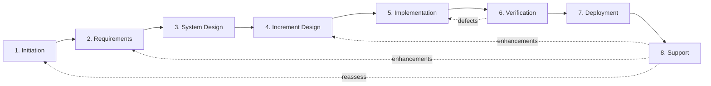

# Agentic Workflow Guide

## Overview

Structured entry point for AI agents working with the AI-Assisted SDLC framework
— providing machine-readable stage routing, artifact dependencies, and fallback
protocols in a single file.

### Why This Guide

The framework's stage guides, checklists, and references are optimized for human
readers navigating one stage at a time. An AI agent dropped into this repository
needs a different interface: a single file with structured metadata for
programmatic routing and enough narrative context to operate autonomously across
stages. This guide is that interface.

### Purpose

- Provide a single entry point for agents to orient in this repository
- Expose stage routing, inputs/outputs, and gates as structured YAML
- Define fallback protocols for common agent failure modes
- Establish session continuity conventions for multi-session work

### Key Principle

Front matter is the agent's primary interface; the body provides human-readable
context for the same information. Parse the YAML first, read the prose when you
need rationale or nuance.

### How to Use This Guide

1. **Parse the front matter** — stage routing, artifact dependencies, gates, and
   fallback rules are all in the YAML block above
2. **Identify your current stage** from the [**Stage Routing**](#stage-routing)
   table
3. **Check inputs and outputs** — verify required inputs are available before
   starting a stage
4. **Follow gate requirements** — each stage specifies what human oversight is
   needed
5. **Use fallback protocols** when stuck — see
   [**Error and Fallback Guidance**](#error-and-fallback-guidance)
6. **Maintain session logs** — see
   [**Session Continuity Protocol**](#session-continuity-protocol) for
   multi-session work

> **Human readers using chat-based AI tools?** See the
> [Manual Process Guide](manual-process.md) instead — it provides bootstrap
> prompts and step-by-step instructions for working with AI assistants that
> don't have filesystem access.

---

## Stage Routing

This table mirrors the `stages` array in the front matter. Use the front matter
for programmatic access; use this table for quick human reference.

| #   | Stage            | Pattern      | Default Autonomy | Gate Type                         | Feeds Into       |
| --- | ---------------- | ------------ | ---------------- | --------------------------------- | ---------------- |
| 1   | Initiation       | Foundational | Collaborative    | Human approval                    | Requirements     |
| 2   | Requirements     | Foundational | Collaborative    | Human approval                    | System Design    |
| 3   | System Design    | Foundational | Collaborative    | Alignment review + human approval | Increment Design |
| 4   | Increment Design | Iterative    | Collaborative    | Specialized review                | Implementation   |
| 5   | Implementation   | Iterative    | AI-Led           | CI validation + human approval    | Verification     |
| 6   | Verification     | Iterative    | AI-Led           | CI validation + human spot-check  | Deployment       |
| 7   | Deployment       | Iterative    | Human-Led        | Human execution required          | Support          |
| 8   | Support          | Continuous   | Collaborative    | Human approval                    | Multiple stages  |

**Execution patterns:**

- **Foundational** (stages 1–3) — run once per project, revisitable when
  assumptions change
- **Iterative** (stages 4–7) — repeat per increment of deliverable work
- **Continuous** (stage 8) — ongoing after first production deployment

For full stage definitions, see [AI-Assisted SDLC Stages](stages.md).

---

## Artifact Dependencies

This table maps each stage's key outputs to their templates, upstream
dependencies, and downstream consumers. Derived from stage front matter
(`inputs`, `outputs`, `feeds_into`) cross-referenced with
[AI-Assisted SDLC Stages](stages.md). For the machine-readable source of truth,
parse the `stages` array in this file's front matter.

All template paths are relative to `templates/`.

| Stage            | Artifact                 | Template                    | Depends On                                     | Feeds Into                          | Gate                             |
| ---------------- | ------------------------ | --------------------------- | ---------------------------------------------- | ----------------------------------- | -------------------------------- |
| Initiation       | Initiation Brief         | `initiation-brief.md`       | _External inputs_                              | Requirements                        | Gate 1 (Investment Decision)     |
| Initiation       | Assumptions & Risks List | —                           | _External inputs_                              | Requirements                        | Gate 1                           |
| Initiation       | Timeline Estimate        | —                           | _External inputs_                              | Requirements                        | Gate 1                           |
| Requirements     | Requirements Document    | `requirements-brief.md`     | Initiation Brief                               | System Design                       | Requirements Readiness           |
| Requirements     | User Stories + ACs       | —                           | Initiation Brief                               | Increment Design, Implementation    | Requirements Readiness           |
| Requirements     | Feature Backlog          | —                           | Initiation Brief                               | Increment Design                    | Requirements Readiness           |
| Requirements     | Traceability Matrix      | —                           | Requirements Document                          | System Design                       | Requirements Readiness           |
| System Design    | Architecture Diagrams    | `system-design-brief.md`    | Requirements Document, NFRs                    | Increment Design, Implementation    | Architecture Review + Gate 2     |
| System Design    | Technology ADRs          | `adr.md`                    | Requirements Document                          | Implementation                      | Architecture Review + Gate 2     |
| System Design    | Increment Plan           | —                           | Requirements Document                          | Increment Design                    | Architecture Review + Gate 2     |
| System Design    | Infrastructure Plan      | —                           | NFRs                                           | Deployment                          | Architecture Review + Gate 2     |
| System Design    | Gate 2 Decision Package  | `gate-decision.md`          | All System Design outputs                      | —                                   | Gate 2 (Investment Decision)     |
| Increment Design | Component Designs        | `increment-design-brief.md` | Architecture, Increment Plan, Stories + ACs    | Implementation                      | Design Review                    |
| Increment Design | API Specifications       | —                           | Architecture                                   | Implementation                      | Design Review                    |
| Increment Design | Test Strategy            | —                           | Stories + ACs                                  | Implementation, Verification        | Design Review                    |
| Implementation   | Working Code             | `implementation-brief.md`   | Component Designs, Architecture, Stories + ACs | Verification                        | PR Review + CI                   |
| Implementation   | Unit Tests               | —                           | Working Code, Test Strategy                    | Verification                        | PR Review + CI                   |
| Verification     | Test Results             | `verification-brief.md`     | Working Code, Stories + ACs, Test Strategy     | Deployment                          | Test Execution + Coverage Review |
| Verification     | UAT Sign-Off             | —                           | Test Results                                   | Deployment                          | Test Execution + Coverage Review |
| Verification     | Defect Reports           | —                           | Test Results                                   | Implementation _(rework)_           | Test Execution + Coverage Review |
| Deployment       | Deployed System          | `deployment-brief.md`       | Verified Code, UAT Sign-Off, Rollback Plan     | Support                             | Production Deployment Approval   |
| Deployment       | Release Notes            | —                           | Deployed System                                | Support                             | Production Deployment Approval   |
| Deployment       | Updated Runbooks         | `runbook.md`                | Deployed System                                | Support                             | Production Deployment Approval   |
| Deployment       | Baseline Measurements    | —                           | Deployed System, Success Criteria              | Support                             | Production Deployment Approval   |
| Deployment       | Retrospective            | `retrospective.md`          | Deployed System, Session Logs                  | Increment Design _(next increment)_ | —                                |
| Support          | Availability Metrics     | `support-brief.md`          | Deployed System, Monitoring                    | —                                   | Production Ownership Decision    |
| Support          | Success Criteria Reports | —                           | Baseline Measurements                          | Initiation _(reassess)_             | Production Ownership Decision    |
| Support          | Enhancement Backlog      | —                           | Incident Reports                               | Requirements, Increment Design      | Production Ownership Decision    |

### Stage Flow Diagram

**Solid arrows** show the primary forward flow. **Dashed arrows** show feedback
loops — defects return to Implementation for rework, enhancements feed back to
Requirements or Increment Design, and Support findings may trigger reassessment
of Initiation assumptions.

---

## Quick Start by Autonomy Tier

### Human-Led

The agent assists on request. Humans drive every step.

1. Read the stage README for guidance and rationale
2. Wait for human instructions before producing artifacts
3. Generate drafts, options, and analyses when asked
4. Present outputs for human review before proceeding

### Collaborative

The agent co-authors within human-set boundaries. This is the default tier.

1. Read the stage README and checklist
2. Propose a work plan for the current stage
3. Draft artifacts proactively, flagging assumptions
4. Pause at gates for human review and approval
5. Iterate based on human feedback

### AI-Led

The agent drives the process. Humans validate at gates.

1. Read the stage README, checklist, and reference (if available)
2. Assess inputs — flag any that are missing or ambiguous
3. Execute stage activities autonomously, following the stage guide
4. Self-validate intermediate work against checklist criteria
5. Present completed artifacts at gates for human validation
6. Between increments: review the previous increment's retrospective (if any)
   and check pre-mortem assumptions before starting the next Increment Design
7. Use fallback protocols (below) when blocked

For oversight intensity within AI-Led (Active / Passive / Minimal), see the
[AI Assistance Scorecard: Oversight Intensity](ai-assistance.md#oversight-intensity).

---

## Error and Fallback Guidance

These protocols match the `fallback` section in the front matter. Use them when
the agent encounters obstacles during autonomous operation.

### Missing Input

An expected input artifact is unavailable or incomplete.

1. Check whether the input can be derived from available context
2. If derivable, produce the input and flag it with `[ASSUMED]` — clearly state
   what was assumed and why
3. If not derivable, request the input from the human
4. Do not proceed past a gate with assumed inputs unless the human explicitly
   approves

### Failed Gate

A gate check fails — checklist criteria not met, tests failing, or review
rejected.

1. Document the specific failure reason
2. Attempt remediation (fix the issue, update the artifact)
3. Re-run the gate check
4. If remediation fails after one retry, escalate to the human with a summary of
   what was tried

### Ambiguous Requirements

Requirements can be interpreted multiple ways.

1. List all reasonable interpretations
2. Assess risk and effort for each interpretation
3. Recommend the interpretation with the lowest risk
4. Request the human to confirm before proceeding
5. Document the decision and rationale

### Unreachable Human

The agent needs human input but cannot get it (async workflow, human
unavailable).

1. Continue with the lowest-risk option
2. Flag every decision made without human input
3. Compile a decision log for the human to review when available
4. Do not proceed past hard gates (Gate 1, Gate 2, production deployment)
   without human approval

---

## Session Continuity Protocol

Multi-session work requires explicit context handoff. Use the session log
template to maintain continuity across sessions, agents, or participants.

### Read on Start

At the beginning of every session:

1. Read the session log for the current stage (if one exists)
2. Review the "Context for Next Session" and "Next Steps" from the last entry
3. Check artifact progress to understand current state
4. Confirm your understanding with the human before proceeding

### Write on End

At the end of every session:

1. Update the session log with a new entry
2. Record what was completed, what is in progress, and what decisions were made
3. Note any deviations from the design brief — where implementation diverged
   from plan and why
4. Document any blockers
5. Write "Context for Next Session" — the critical information the next
   agent/human needs to continue without re-reading everything
6. List specific "Next Steps" as actionable items
7. Record any framework-level observations (template gaps, unclear guidance,
   missing checklist items) in the retrospective's Framework Feedback section;
   flag these for human review

### Session Log Template

Each stage's work gets its own session log file, stored alongside the stage's
artifacts. Create a new log file per stage (e.g.,
`stages/initiation/session-log.md`) and update it at the start and end of every
session.

Use [Session Log](../templates/session-log.md) (`templates/session-log.md`) for
all stages. The generalized template captures stage name, autonomy tier,
oversight level, artifact progress, and per-session entries including decisions
made and context for the next session.

For the Implementation stage specifically, use the
[Implementation Session Log](../templates/implementation-session-log.md)
(`templates/implementation-session-log.md`) — a specialized variant optimized
for code-focused session tracking.

---

## Notes

**Last Updated:** 2026-03-01

Added to framework in v0.23.0. Artifact dependency graph added in v0.23.0.
