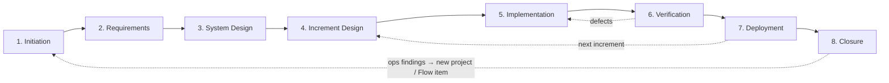

# Agentic Workflow Guide

> **New here?** See [Framework Overview](OVERVIEW.md#agentic-workflow-guide) for
> what this guide is, why it exists, and how to use it. This file is the
> operational reference.

## Key Principle

Stage READMEs (`stages/*/README.md`) are the **canonical source** for stage
metadata — inputs, outputs, checkpoints, and RACI roles. Autonomy is an
operating-model choice, not a stage property (see the
[Operating Model Guide](operating-model.md)); the pipeline's revisit conditions
live in the [Stages Guide](stages.md). This guide provides cross-cutting
concerns: artifact paths, working locations, fallback protocols, and session
conventions.

> **Role assignments:** This guide defines _what_ to do at each stage. For _who_
> does it, see [Roles and Responsibilities](roles.md#roles-and-responsibilities)
> in the Roles Guide. The RACI matrix defines which role is Responsible,
> Accountable, Consulted, or Informed at each stage.

---

## Stage Routing

For stage ordering, execution patterns, and the dependency graph, see the
[Seichi Framework Stages](stages.md) pipeline front matter. For per-stage
metadata (inputs, outputs, checkpoints, RACI), parse the stage README front
matter in `stages/*/README.md`. The `working_location` field in each stage
README indicates where the agent should operate — either the artifacts
repository (`docs/`) or the source code repository. See
[Working Locations](framework.md#working-locations) for the full three-location
model.

### Brownfield-First Project Routing

For brownfield projects introducing AI assistance for the first time, route
through stages with additional focus:

1. **Initiation** — assess brownfield readiness across five axes (verifiability,
   modularity, discoverability, transparency, consistency). See
   [Brownfield Readiness Guide](brownfield-readiness.md#readiness-rubric)
2. **System Design** — refine the readiness assessment with evidence, plan
   discovery or preparation increments, and define feature flag strategy for
   modifying existing endpoints
3. **Increment Design** — map scope to readiness axes; discovery increments use
   deliverable-oriented scope (D-1, D-2 IDs) rather than feature-oriented scope
4. **Subsequent stages** — proceed normally using iterative stage patterns

### Zero-to-One Project Routing

A new project reaches the framework through one front door — idea formation, the
adaptive interview defined in
[Initiation: Arriving with Only an Idea](../stages/initiation/README.md#arriving-with-only-an-idea)
— by one of **two on-ramps**:

- **Cold (greenfield).** A user arrives with only an idea — "I have an idea for
  X," no existing artifacts, no workspace, no formed project description. The
  interview starts from a blank page.
- **Warm (from the backlog).** A **Promoted** idea-backlog entry (`IDEA-NNN`)
  already carries a problem statement and an origin (see
  [The Learning Loop](learning-loop.md#closing-the-portfolio-loop)). The
  interview starts there — deepening, validating, and seeding the project's
  operating configuration — rather than from scratch.

Either way, do not ask the user to pick a framework entry point or answer
classification questions. Route into idea formation:

1. **Idea formation** — interview from the idea to Initiation-ready inputs: a
   candidate problem statement, a target user, and the riskiest assumptions
   surfaced. Scale the interview's depth to the inferred stakes and infer the
   classifications rather than fronting them — the exit criteria, interview
   contract, and adaptive frame are defined in
   [Initiation: Arriving with Only an Idea](../stages/initiation/README.md#arriving-with-only-an-idea).
   On the warm on-ramp, the backlog entry's problem statement is the interview's
   starting point, not a blank page
2. **Classify by inference** — derive tier, project type, deployment intent,
   operating posture, Required Assurance, and the executor read path from the
   conversation and present them as overridable `[ASSUMED]` defaults, rather
   than asking the user to choose from framework taxonomies. See
   [Classification by Inference](#classification-by-inference)
3. **Scaffold and seed** — only after the interview, create the workspace (see
   [Quick Start](../QUICKSTART.md)) and seed the Initiation Brief with the
   interview output
4. **Proceed with Initiation** — continue the stage normally at the inferred
   tier; Gate 1 still applies, and locks the operating posture the interview
   proposed

---

## Classification by Inference

A new project carries six classification decisions — tier, project type,
deployment intent, operating posture, Required Assurance, and the executor read
path — all set at intake. The binding contracts are AW-004 (the decision set and
its conservative-inference rules) and AW-004a (never fronted as menus at first
contact) in the
[Operating Model Spec § Project Operating Configuration](../spec/operating-model.md#project-operating-configuration).
A first-time user cannot answer these before understanding the framework, so
derive them from two or three natural questions woven into the opening
conversation:

- _"Is this just you, or a team?"_ → stakeholder reach, candidate tier
- _"Is this an experiment, or something you'll run for real?"_ → tier,
  deployment intent
- _"Deploying anywhere yet, or local for now?"_ → deployment intent
- _"Starting fresh, or building on existing code?"_ → project type

The **executor read path** is inferred from the executor, not the operator:
default to `guided` when the executor is unknown, and let behavioral evidence —
sound implementation from contracts alone, versus structure-guessing, many
clarifying questions, or convention drift — move it. At first encounter, start
from the qualification evidence held for the executor configuration — see the
[starting-point table](operating-model.md#read-path-starting-points) for the
evidence classes and trial mechanism (never a model or benchmark name). Like the
others it is confirmed at Gate 1, re-calibrated at each retrospective, and
re-evaluated when the executor configuration materially changes (including its
reasoning effort).

Present the derived classifications as overridable assumptions using the
`[ASSUMED]` convention, recorded in the Initiation Brief's right-sizing section:

> `[ASSUMED]` Tier: Minimal — solo experiment, no sensitive data. `[ASSUMED]`
> Project type: Greenfield — empty repository. `[ASSUMED]` Deployment intent:
> Local-only for now. `[ASSUMED]` Operating posture: Checkpointed — framework
> default for a first project. `[ASSUMED]` Executor read path: Guided — executor
> unproven; the retrospective calibrates. Say the word and any of these change.

The binding rules ride
[AW-004/AW-004a](../spec/operating-model.md#project-operating-configuration):
never front a framework taxonomy — introduce vocabulary later, when a
classification first matters (typically at Gate 1); default conservatively when
signals are missing or conflict; escalation triggers override inference
(sensitive data, compliance requirements, or external users force Standard or
Enterprise — see the [Right-Sizing Guide](right-sizing.md)); and inferred values
are hypotheses, confirmed at Gate 1 like any other `[ASSUMED]` item — see
[Reviewing \[ASSUMED\] Items](#reviewing-assumed-items).

**Gate-authority mechanism — surface the policy option.** Gate clearance is
itself an inferred dimension: a gate may be cleared by an **interactive human**
or by **pre-authorized policy** (a discretion-free proceed-if rule the run
evaluates) — both human-owned (see
[Operating Model Guide § Authority](operating-model.md#authority--who-may-decide)).
The default inference is interactive, but a user on a default run never learns
the policy option exists. Surface it once, as an overridable default:

> Default: I'll check with you at each gate. You can instead set a _proceed-if_
> policy — e.g., "clear Gate 2 when the design covers all FRs and the estimate
> is under budget" — and I'll clear the gate automatically when the conditions
> hold. Say the word.

Consequence-scaled (inherits the [H] floor): at low consequence with clear,
machine-checkable conditions, lean toward offering the policy option; at
**Critical / severe-harm irreversible transitions, do not offer it —
interactive-only**. A "policy" whose conditions need judgment is delegation, not
policy, and must never be offered as a floor-satisfying clearance.
**Discoverability only** — never auto-switch a gate to policy without the user
setting it; the default stays interactive and conservative.

**Negligible routes to the folded path.** When inference lands at the bottom of
the scale — a throwaway spike, no compliance, blast radius confined to the
builder — classify that **early, before front-loading**, and route to the
[Negligible Folded Path](right-sizing.md#the-negligible-folded-path): the
classification core is already read (per
[the load line](#read-order-and-the-load-line)), so **materialize only the
floor** and run the process as one conversation rather than narrated stages.
"One conversation" still **writes the paragraph-brief down** as one durable file
(a root `DECISIONS.md`) — the classification inferences, `[ASSUMED]` calls,
scope, and approach decisions persist beside the code, never only in the
transcript (see
[The Negligible Folded Path](right-sizing.md#the-negligible-folded-path)).
AW-004's escalation triggers still override — compliance or external users pull
a project off the folded path even when it otherwise looks Negligible.

**Calibrate the register, not only the classifications.** Read the operator's
technical comfort the same way you read the six decisions — from how they talk
(their vocabulary, the questions they ask, how they answer), never by asking
them to rate themselves. A "how technical are you?" question fronts the
classification exactly as a taxonomy menu does (AW-004a) and can read as
patronizing. Adjust wording and pace to the comfort you infer, holding to
cross-functional accessibility ([framework.md](framework.md), principle #5).
This is a calibration woven into the interview, not a new phase or gate — it
adds no ceremony.

---

## Artifact Dependencies

Each stage's `inputs` and `outputs` are defined in its README front matter
(`stages/*/README.md`). The `feeds_into` field in the [Stages Guide](stages.md)
pipeline front matter defines the dependency graph.

**Embedded artifact resolution rule:** When a stage input names an artifact
declared `embedded_in` a parent artifact, the parent artifact satisfies the
input requirement. For example, System Design's input
`non-functional-requirements` is satisfied by the Requirements Brief (which
contains the NFR section).

### Gate Decision Template Selection

- **Hard gates** (Gate 1, Gate 2): use `templates/gate-decision.md`
- **Non-investment checkpoints** (all others, including Production Deployment
  Approval): use `templates/checkpoint-decision.md`
- **PR Review + CI**: the PR approval itself serves as the gate artifact; no
  separate decision template is required

### Stage Flow Diagram

**Solid arrows** show the primary forward flow. **Dashed arrows** show feedback
loops — defects return to Implementation for rework, Deployment feeds into
Increment Design for the next increment, and Closure closes the project with a
handoff to Operations. Operations findings feed back as new
[Flow](stages.md#flow-delivery-mode) items or projects.

---

## Quick Start by Operating Posture

### Supervised

Work Execution is **Collaborative**; Authority is interactive at every step. The
agent works in short steps and a human reviews each one before it proceeds. The
difference from Checkpointed is cadence — review at every step here, rather than
at deliberately placed checkpoints.

1. Read the stage README for guidance and rationale
2. Propose the next small step, then draft it
3. Generate drafts, options, and analyses in short, reviewable increments
4. Present each step for human review before proceeding

### Checkpointed

Work Execution is **Collaborative**; Authority is interactive at checkpoints,
with pre-authorized policy between. The agent co-authors within human-set
boundaries. This is the default posture.

1. Read the stage README and checklist
2. Propose a work plan for the current stage
3. Draft artifacts proactively, flagging assumptions
4. Pause at checkpoints for human review and approval
5. Iterate based on human feedback

### Lights-Out

Work Execution is **Agents**; Authority is delegated or pre-authorized. The
agent drives the process. Humans validate at gates.

1. Read the stage README, checklist, and reference (if available)
2. Assess inputs — flag any that are missing or ambiguous
3. Execute stage activities autonomously, following the stage guide
4. Self-validate intermediate work against checklist criteria
5. Present completed artifacts at gates for human validation
6. Between increments: review the previous increment's retrospective (if any)
   and check pre-mortem assumptions before starting the next Increment Design
7. Use fallback protocols (below) when blocked

For Required Assurance levels and Authority configuration across postures, see
the [Operating Model Guide](operating-model.md).

---

## Agent Execution Model

Recommended workflow for AI coding agents operating in this repository:

1. **Orient** — read the **classification core** and orient, following
   [Read Order and the Load Line](#read-order-and-the-load-line): read this
   guide for stage routing, classify the scenario and governance weight, then
   load the governance spine and the **current** stage's material — do not
   front-load downstream stages. Determine your working location from the
   `working_location` field in the current stage's README front matter.
2. **Locate stage** — identify the current stage from the routing section; read
   the stage README, checklist, and reference. If the current stage — or the
   scenario itself — is not clear from the human's request, run the
   [Session-Start Orientation](session-protocol.md#orient--classify-the-scenario-first-contact)
   protocol: a cheap environment read that classifies the scenario into the four
   entry routes (idea formation, brownfield adoption, continue, add a project).
3. **Check inputs** — verify required inputs (listed in stage README front
   matter) are available; flag any missing inputs with `[ASSUMED]`
4. **Execute** — follow the stage guide activities at the project's operating
   posture; self-validate against the checklist
5. **Gate** — present completed artifacts for human review at defined gates;
   follow fallback protocols from `stages/[stage]/reference.md` if blocked
6. **Log** — for multi-session work, maintain a session log using
   `templates/session-log.md`; read on start, write on end

---

## Read Order and the Load Line

Read **stage-scoped**, not whole-corpus. The framework is large; an agent that
front-loads every guide, stage, and template before acting pays a fixed
per-session comprehension cost on material the current stage mostly does not
need. Load the cross-cutting governance that binds _throughout_, plus the
**current** stage's material — and defer downstream stages' guides, references,
and templates until the run reaches them.

The line between _always-loaded_ and _deferred_ — the **load line** — is fixed
below. The `core`/`ref` tier in [`INDEX.md`](../INDEX.md) marks reading _depth_
within a topic; the load line is orthogonal, marking which files cross-cut every
stage (always) versus which belong to one stage or context (deferred until
reached).

**Capable-executor read path.** Where the spec layer covers a contract, the spec
(`spec/`), the right-sizing tables, and the templates are the intended read path
for highly capable executors; the guides are rationale and scaffolding, pulled
on demand. The binding contracts are AW-016 (the load line) and AW-017 (the
capable-executor read path — including what contracts-only never exempts: the
security throughline, checkpoints, the stage map, and session orientation) in
the
[Execution Spec § Read Order and the Load Line](../spec/execution.md#read-order-and-the-load-line).

### Always loaded — the cross-cutting governance

Read at session start and honor throughout, regardless of stage or tier: the
**Tier 0 classification core** (enough to orient, classify the scenario, and
classify governance weight before committing to any further read) and the **Tier
1 governance spine** (the non-delegable floor, the gate and checkpoint rules,
the compliance hooks, and the security throughline — never scoped away by
stage). The binding tier lists are AW-016 in the
[Execution Spec](../spec/execution.md#aw-016--load-line-tier-01-read-order).

### Deferred — load on entry to the stage or context

Stage-scoped material — each stage's README, checklist, reference, and templates
— loads when the run **enters** the stage; contextual guides load on their
triggering condition (operations, learning-loop, delegated-run, parallel-batch,
brownfield, roles, setup) — and never [`OVERVIEW.md`](OVERVIEW.md), the
human-only orientation layer. The binding lists are AW-016's rule.

### What stage-scoping must not cost

Two floors bind the scoping: **forward references stay visible** (defer
downstream _guides_, never downstream _constraints_ — the always-loaded stage
map carries each stage's inputs and outputs for exactly this reason), and **the
load line is a floor, not a ceremony budget** (lighter tiers thin what is
materialized, never the line itself, and never below the compliance or
non-delegable floor). The binding contract is AW-018 in the
[Execution Spec](../spec/execution.md#aw-018--stage-scoping-floor-defer-guides-never-constraints).

---

## Narrating Foundational Stages at Minimal

At **Minimal** tier the three foundational stages — Initiation, Requirements,
System Design — still run, and their **decisions are captured in the canonical
project state**: the high-level design, the increment plan, the readiness calls,
and the traceability chain (goal → success criterion → requirement → acceptance
criterion → test). The formal briefs are **rendered views** over that state (see
[Canonical State Spec](../spec/canonical-state.md)); at Minimal those views fold
into lighter forms. What thins is the **presentation and the rendering**, not
the decisions: narrate each stage **compactly** — a few sentences on what it
produced and what it decided, with a pointer to where the decision is recorded —
rather than emitting each full brief inline for the operator to scroll. The felt
weight at Minimal is mostly the wall of generated text, not the decisions
underneath; a compact running narration removes that weight without dropping a
stage, a decision, or the gate record.

This is presentation, not structure — every Minimal **decision** is still
captured in canonical state and still gated; the briefs are rendered as the tier
calls for, some folding into lighter notes (see
[Minimum Viable Artifacts](right-sizing.md#minimum-viable-artifacts)). At
**Negligible** the structure folds further — only the paragraph-brief survives,
and _survives_ means **persisted to a durable file** (a root `DECISIONS.md`),
not merely spoken; see
[The Negligible Folded Path](right-sizing.md#the-negligible-folded-path).

---

## Error and Fallback Guidance

Use these protocols when the agent encounters obstacles during autonomous
operation.

> **Supervised posture:** the agent halts and presents the situation rather than
> acting autonomously — AW-019 in the
> [Execution Spec § Fallback Protocols](../spec/execution.md#fallback-protocols).
> The protocols below assume Checkpointed or Lights-Out postures.

### Missing Input

An expected input artifact is unavailable or incomplete: derive it from
available context and flag it `[ASSUMED]` (stating what was assumed and why), or
request it — and never pass a gate on assumed inputs without explicit human
approval. The binding protocol is AW-020 in the
[Execution Spec](../spec/execution.md#aw-020--missing-input-protocol-derive-assumed-or-request).

### Reviewing [ASSUMED] Items

When an artifact reaches gate review, every `[ASSUMED]` item requires an
explicit disposition — **Confirm**, **Challenge**, or **Carry forward** (as a
tracked condition with an owner) — and no gate passes with an unaddressed item.
The binding contracts are AW-006 (the assumed-classification convention) and
AW-021 (the gate disposition) in the
[Execution Spec § The \[ASSUMED\] Convention](../spec/execution.md#the-assumed-convention).

### Failed Gate

A gate check fails — checklist criteria not met, tests failing, or review
rejected: document the failure, remediate once, re-run; at hard gates (Gate 1,
Gate 2) skip autonomous remediation and escalate immediately. The binding
protocol is AW-022 in the
[Execution Spec](../spec/execution.md#aw-022--failed-gate-protocol).

### Ambiguous Requirements

Requirements can be interpreted multiple ways: list the reasonable
interpretations, assess risk and effort, recommend the lowest-risk reading,
confirm with the human, and document the decision. The binding protocol is
AW-023 in the
[Execution Spec](../spec/execution.md#aw-023--ambiguous-requirements-protocol).

### Unreachable Human

The agent needs human input but cannot get it: continue with the lowest-risk
option within the posture's bounds (at Checkpointed, within the current stage
only; at Supervised, halt), flag every decision made without human input,
compile a decision log — and never proceed past a hard gate without human
approval. The binding protocol is AW-024 in the
[Execution Spec](../spec/execution.md#aw-024--unreachable-human-protocol).

### Precedence and Compound Conditions

When multiple fallback conditions apply simultaneously, resolve in order: **hard
gate constraints** first, then **unreachable human**, **missing input**, and
**ambiguous requirements** last. The ordered set binds as kernel data
(`fallback_precedence`) under AW-025 in the
[Execution Spec](../spec/execution.md#aw-025--fallback-precedence-order).
Stage-specific fallback guidance in `stages/[stage]/reference.md` extends these
central protocols and takes precedence for its stage, at all operating postures
unless the stage reference restricts it.

---

## Session Continuity Protocol

> **Quick reference:** the step-by-step lists are SP-008 (session start on a
> known project) and SP-009 (session end) in the
> [Execution Spec § Session Continuity](../spec/execution.md#session-continuity);
> [Session Protocol](session-protocol.md) routes to them. This section has the
> narrative and edge cases.

Multi-session work requires explicit context handoff. Use the session log
template to maintain continuity across sessions, agents, or participants.

### Read on Start

At the beginning of every session, read the stage's session log and the last
entry's "Context for Next Session" before proceeding; at the end, write the new
entry — completed / in-progress / decisions, deviations from the design brief,
blockers, context and next steps for the successor, and any friction. The
binding contract is AW-026 in the
[Execution Spec § Session Continuity](../spec/execution.md#session-continuity);
the operational step lists are SP-008 and SP-009.

### Write on End

Covered by
[AW-026](../spec/execution.md#aw-026--session-continuity-read-on-start--write-on-end)
above — the session-end step list is SP-009 in the
[Execution Spec](../spec/execution.md#sp-009--session-end-steps).

### Session Log Template

Each stage's work gets its own session log file, stored alongside the stage's
artifacts. Create a new log file per stage (e.g.,
`docs/session-logs/initiation-session-log.md`) and update it at the start and
end of every session.

Use [Session Log](../templates/session-log.md) (`templates/session-log.md`) for
all stages. The generalized template captures stage name, operating posture,
assurance level, artifact progress, and per-session entries including decisions
made and context for the next session.

For the Implementation stage specifically, use the
[Implementation Session Log](../templates/implementation-session-log.md)
(`templates/implementation-session-log.md`) — a specialized variant optimized
for code-focused session tracking.

### Revision History Roles

When recording revision history in artifacts (Author, Approved By columns), use
these role definitions to clarify each contributor's relationship to the
content:

- **Author** — shaped the content. The person or agent who drove the substance
  of the artifact, not merely the one who typed or generated text.
- **Reviewer** — reviewed the artifact and provided substantive feedback that
  influenced the final content.
- **Approver** — approved the artifact without substantive changes. Confirms the
  artifact meets gate criteria.

**Format:** `Name (Role)` — e.g., `Jane Smith (Author)`,
`Claude Sonnet (Reviewer)`.

**Agent-specific guidance:** Role reflects who drove the work, not who typed. An
agent that generates an artifact from a detailed human brief is typically listed
as Author only if it made substantive decisions beyond mechanical translation.
Consider the operating posture:

| Operating Posture | Typical Author            | Rationale                              |
| ----------------- | ------------------------- | -------------------------------------- |
| Supervised        | Human                     | Human shaped all content               |
| Checkpointed      | Human and/or agent        | Depends on who drove each section      |
| Lights-Out        | Agent (human as Approver) | Agent drove substance; human validated |

When multiple contributors share authorship, list each with their role. When in
doubt, credit the contributor who made the substantive decisions rather than the
one who generated text.

### Feedback Capture Protocol

When friction arises during any stage — a surprise, a deviation from design, a
process gap, a product or tech-debt observation, or a tooling problem — capture
it immediately rather than waiting for the retrospective session.

**Steps:**

1. Locate the project's friction log. It is a standing, project-spanning
   artifact created at project start; if it does not yet exist, create it from
   the [Friction Log Template](../templates/friction-log.md).
2. Append a numbered entry (`F-NNN`, continuous for the life of the project)
   recording what was observed, its impact, and a likely improvement.
3. Type the entry — Process, Execution, Product, or Tooling. See
   [The Learning Loop](../guides/learning-loop.md#friction-types). If the type
   is not obvious, leave it for the retrospective to assign.
4. Leave **Status** as Open and **Disposition** blank. The retrospective triages
   each entry and routes it — see
   [The Learning Loop](../guides/learning-loop.md#triage-cadences).

> Agents: this is a write action. Follow artifact location conventions in
> [Working Locations](../guides/framework.md#working-locations) and verify the
> correct artifacts path before writing.

### Cross-Location Handoff Protocol

When work crosses location boundaries — especially from source code
(Implementation) back to artifacts (briefs, session logs) or forward to
Verification — decisions, deferrals, and deviations must flow back explicitly.

#### What Flows Back

| Item Type              | Example                                | Target Artifact                                     |
| ---------------------- | -------------------------------------- | --------------------------------------------------- |
| Decisions              | Chose library X over Y for concurrency | Implementation brief + session log                  |
| Deferrals              | Deferred pagination to next increment  | Implementation brief "Known Issues" + carry-forward |
| Deviations from design | API endpoint changed from POST to PUT  | Session log + implementation brief                  |
| Emergent requirements  | Discovered need for rate limiting      | Friction log (Product-type entry)                   |

#### Sync Points

1. **End of session** — update session log with decisions and deviations
2. **End of increment** — finalize implementation brief, sync deferrals to
   carry-forward list
3. **Verification handoff** — ensure all implementation decisions are documented
   for testers
4. **Next increment design start** — review carry-forward items and
   retrospective feedback before scoping

#### Agent Protocol

At each sync point, agents should:

1. Review the session log for undocumented decisions or deviations
2. Update the implementation brief with any decisions not yet recorded
3. Record deferrals in the implementation brief "Known Issues" section and flag
   them for carry-forward
4. Capture emergent requirements as friction-log entries (see
   [Feedback Capture Protocol](#feedback-capture-protocol))
5. Verify that the artifacts location reflects the current state of work in the
   source code location

> See [Working Locations](framework.md#working-locations) for the three-location
> model and [Session Continuity Protocol](#session-continuity-protocol) for
> session log conventions.

---

## Rework Cycles

When a mid-stage discovery breaks something — a design proves infeasible, an NFR
is unmet, or an assumption is invalidated — assess the impact with FW-009's two
diagnostic questions: _does this change the design?_ and _does this affect the
investment assumptions (cost, schedule, risk)?_ Both are spectrums requiring
judgment, not binary gates. The binding contract is FW-009 in the
[Execution Spec](../spec/execution.md#fw-009--impact-assessment-two-question-spectrums);
see the [Impact Assessment](framework.md#impact-assessment) reference table for
common combinations and process guidance.

### Delta-Only Brief Convention

- **New briefs document only what changed** — reference the prior cycle's brief
  for unchanged context rather than duplicating it
- **Reference the prior cycle explicitly** — e.g., "This rework addresses
  verification failures from Increment 2, Cycle 1 (see verification-brief-i2.md
  for defect details)"
- **Design briefs are typically not revised** — unless the verification failure
  reveals a design-level issue, rework stays within Implementation scope
- **Update the Measurement Throughline only if instrumentation changes** — if
  rework doesn't affect how success criteria are measured, carry forward the
  existing measurement plan without revision

---

## Notes

**Last Updated:** 2026-07-16

Added to framework in v0.23.0.
